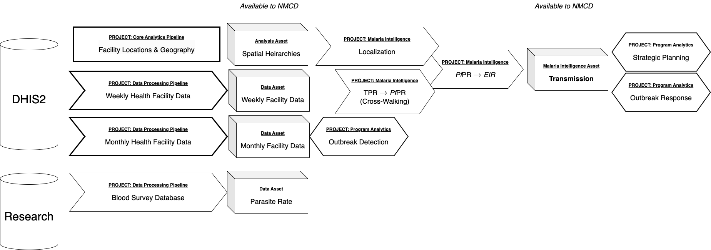

#  {.tabset}

## $\odot$

Uganda's National Malaria Control Division (NMCD) and Department of Health Information (DHI) have been collaborating with the University of Washington and Pilgrim Africa to implement **Adaptive Malaria Control,** which calls for developing a formal process of *repeated analytics* and *iterative policy engagement.* 

Adaptive malaria control involves intensive analysis of malaria surveillance and research data. To that end, the data and analytics are being organized into stable *data processing & analytics pipelines* with stable version controlled data assets and malaria intelligence assets.

+ Given the expectation that analyses will be repeated on a schedule, we have invested in *data systems* that support repeated analysis, through development of *version-controlled* data assets. 

+ Given the need for *accountability* in analyses that can be repeated and that can adapt over time, so we are also developing *version-controlled* algorithms, including elements of data processing and analytics pipelines. 

+ The software implementing data processing and analytics pipelines implemented with *version-control,* to ensure that old analyses can be repeated for diagnostic purposes.

This framework document provides an overview of the projects that are being put in place. It's goal is to serve as a reference and overview of these projects.  The need for stable, version controlled data and algorithms that can be revised over calls for establishing two distinct and well-defined modes. The **operating** versions are stable, well-defined algorithms and some data assets. These are designed to be critically reviewed, revised, and updated on a schedule. The **development** versions of the algorithms and some data sets include new features that are scheduled to be added to the operational versions, once they have been thoroughly verified, validated, and tested for consistency and stability. 

***

At the present time, all projects are in the development stage. The goal for the RAMP-Uganda team is to transform early development into *operating* and *development* versions of the following before Oct 15, 2024:

+ The [**Health Facility Reference Data** Project](HealthFacilityReference.html)

+ The **Weekly Health Facility Data** Project 

+ The **Monthly Health Facility Data** Project 

+ The **Malaria Outbreaks** Project 

*** 

Scheduled for transformation in the near term are: 

+ The **Care Seeking and Catchments** Project

+ The **Transmission Assessment** Project, including 

    - The **TPR to PR Crosswalking** Pipeline 

    - The **PR to EIR** Pipeline 

*** 

## Data Assets

Facility data, maintained in DHIS2 databases, make up some of the core information NMCD relies on to manage malaria.  

## Outbreaks 
