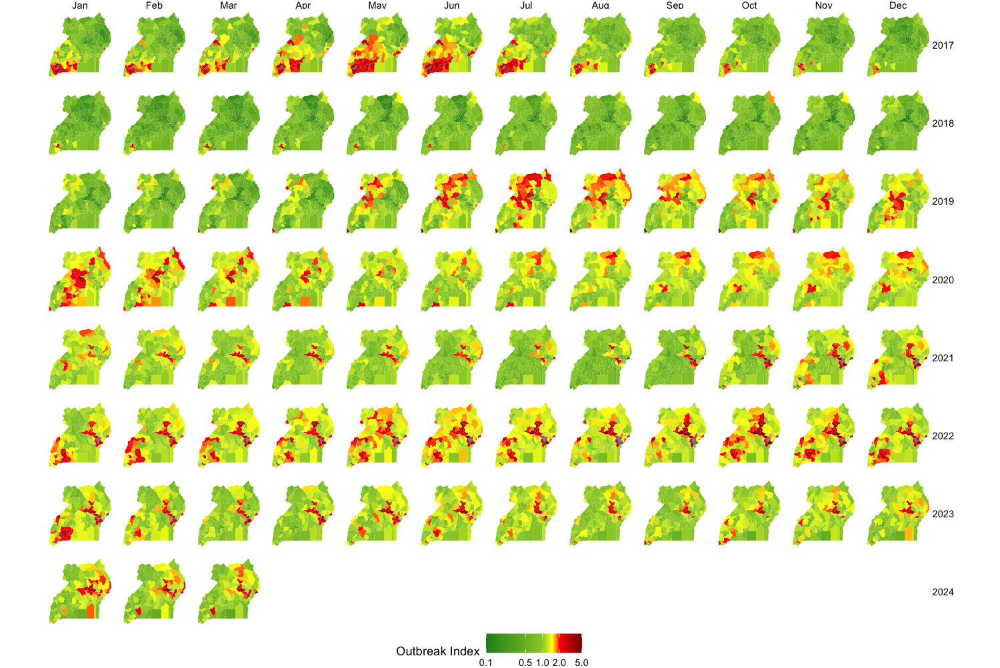

#  {.tabset .tabset-fade .tabset-pills}

## $\odot$ {.tabset .tabset-fade .tabset-pills}

Welcome to the github home of RAMP-Uganda. 

Our goal is to develop and implement **Adaptive Malaria Control,** working in collaboration with the **National Malaria Control Division** (NMCD) of **Uganda**'s National Ministry of Health. 

Adaptive malaria control is a structured, iterative approach to developing malaria intelligence and **r**obust **a**nalytics for **m**alaria **p**olicy (RAMP).
Malaria intelligence is information about malaria needed to support policy developed around stable information systems that involve involve data processing and curation, the transformation of data into information through data analysis, and estimation and imputation to quantify key aspects of malaria transmission, mosquito ecology, human care seeking behaviors, and health systems. 
RAMP analytics use malaria intelligence to formulate policies using simulation-based analytics, including analyses to optimize the allocation of resources, improve technical efficiency, and develop strategy and evidence-based policies to reduce burden and eliminate malaria.
Malaria is managed on monthly and annual cycles, and on multi-year funding and strategic planning cycles.
Adaptive malaria control must support these policy cycles through development of protocols and procedures for repeated analysis to ensure policy advice is consistent, that it is of the highest quality, and that it is updated to be responsive to changing needs.
Through careful analysis of uncertainty and through consultation with program managers, surveillance systems are reviewed to identify key data gaps, and plans are made to fill those gaps and improve future decisions.

*** 

+ **Reports** --- routine reporting for NMCD. 

+ **Outbreaks** --- an outbreak response tool. 

+ **Data** --- a data processing pipeline 

+ **Simulation** --- simulation-based analytics 

## Reports

## Outbreaks 

## Data 

## Simulation 

