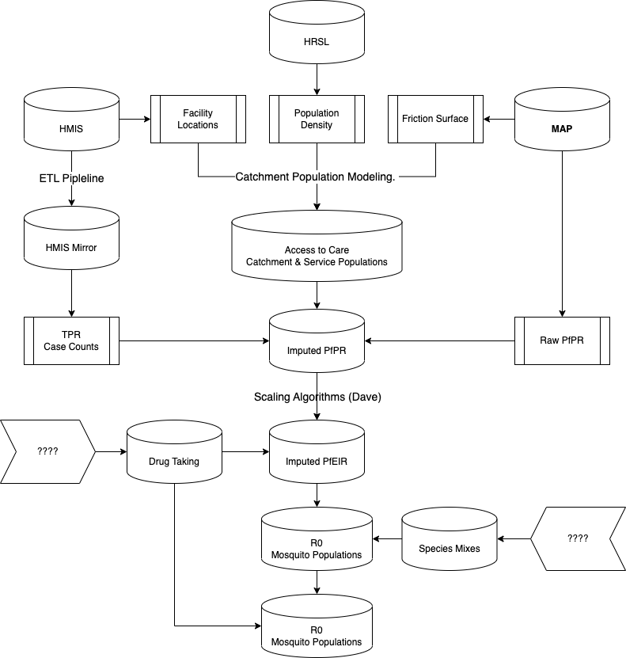

#  {.tabset .tabset-fade .tabset-pills}

## $\odot$ {.tabset .tabset-fade .tabset-pills}

Welcome to the github home for RAMP-Uganda. 

Our goal is to develop and implement **Adaptive Malaria Control,** working in collaboration with the **National Malaria Control Division** (NMCD) and **Division of of Health Information** (DHI) of **Uganda**'s National Ministry of Health. 

Adaptive malaria control is a structured, iterative approach to developing malaria policy that is guided by a bespoke inferential system called RAMP (**R**obust **A**nalytics for **M**alaria **P**olicy) that emphasizes analysis that characterizes, quantifies, and propagates uncertainty.
Malaria intelligence -- information about malaria needed to support policy -- is developed around stable information systems that involve involve data processing and curation, the transformation of data into information through data analysis, and estimation and imputation to quantify key aspects of malaria transmission, mosquito ecology, human care seeking behaviors, and health systems. 
We develop malaria intelligence to evaluate policies using simulation-based analytics, including analyses to optimize the allocation of resources, improve technical efficiency, and develop strategy and evidence-based policies to reduce burden and eliminate malaria.
Malaria is managed on monthly and annual cycles, and on multi-year funding and strategic planning cycles.
Adaptive malaria control must support these policy cycles through development of protocols and procedures for repeated analysis to ensure policy advice is consistent, that it is of the highest quality, and that it is updated to be responsive to changing needs.
Through careful analysis of uncertainty and through consultation with program managers, surveillance systems are reviewed to identify key data gaps, and plans are made to fill those gaps and improve future decisions.

*** 

+ **Data Warehouse** --- development of a data warehouse, including processing pipelines and stable data assets to support robust analytics

+ **Routine Analysis** --- routine reporting and routine analytics to support NMCD operations 

+ **Malaria Intelligence** --- information that is of direct value for strategic planning for malaria policy

+ **Robust Analytics** --- robust, simulation-based analytics 

+ **Adaptive Control** --- evaluating and prioritizing data gaps

## Data Warehouse {.tabset .tabset-fade .tabset-pills}

### $\oplus$ 

The first step is to ensure that we have a set of high-quality **DATA ASSETS**  organized in a **DATA WAREHOUSE** 

**** 

Malaria data is of little use if it is not routinely used, so we have developed data processing pipelines. We call these **ETL pipelines** because they *extract* the data from various sources, *transform* the data -- basic data cleaning tasks such as identification of outliers, consistency checks, and imputation of missing and outliered data -- while tracking modifications with version control, and *load* the data in a format that can be used for analysis by many different parties. The endpoint of the ETL pipeline is a version controlled data asset. 

**Human Demography / Basic Information**

+ Location / GIS  

+ Human Demographic Data

**Malaria Surveillance** 

Uganda's Ministry of Health maintains a health management information system (HMIS). Data from all public and some private facilities is collected and maintained by the Division of Health Information (DHI) in a DHIS-2 database. The current DHIS-2 instance started on  

- Facility Data
    
- Community Health Workers 
    
- Entomological Surveillance
    
**Malaria Research** 

We are also interested in using high-quality malaria research data to supplement Uganda's HMIS data. To this end, we have partnered with the Malaria Atlas Project (MAP) and Vector Atlas.   

- Malaria Atlas Project 
    
- Vector Atlas 

+ *Weather Data*

### Facility Data 

To save lives and set the stage for malaria elimination, Uganda's National Malaria Control Division (NMCD) has and the Division of Health Information (DHI) are collaborating to 
organize a **data warehouse** that holds up-to-data of all sorts describing malaria in Uganda for public use. The primary data source is the DHIS2. 

+ **WEEKLY FACILITY DATA** lives on Box 

+ **MONTHLY FACILITY DATA** lives on Box 

+ **Community Case Workers** ...  

### Location 

We would like to be able to develop maps of various quantities at $1$ km $\times 1$ km, and aggregate up to sub-county, district, and region.  

***

Current (all in Box): 

+ **MASTER FACILITY LIST** 

+ **REGIONAL SHAPE FILES** 

+ **DISTRICT SHAPE FILES** 

+ **SUB-COUNTY SHAPE FILES** 

+ **MAP RASTER** (see MAP) 

+ **SPATIAL HIERARCHIES**  


### Human Demography

We need an estimate of population density by age and sex at $1$ km $\times 1$ km

***

+ HRSL - high resolution settlement layer

+ UNWPP - Human population by age


### MAP

At the moment *Pf*PR data are out of date. We want to make sure that we continue to work with MAP to ensure that they have up-to-date *Pf*PR data. 

### Vector Atlas

We need a plan. 

### Next

+ Present Location / Spatial Hierarchies to DHI / NMCD 

+ Present Facility Data Assets to NMCD (coordinate with DHI) 


## Routine Analysis {.tabset .tabset-fade .tabset-pills}

### $\oplus$

The second step is to organize **Analysis & Reporting** 

+ Weekly Reporting

+ Monthly Reporting

+ Quarterly Reporting

+ Outbreaks 

### Weekly 

*Tom*

+ **Weekly Report Maker** 

+ **Weekly Reports** 

### Monthly 

### Quarterly 

### Outbreaks 


### Next

+ Present outbreaks algorithm to NMCD / DHI 


## Malaria Intelligence {.tabset .tabset-fade .tabset-pills}

### $\oplus$ 

We define *malaria intelligence* as information that is needed for malaria policy. 

+ **Catchments** -- Our goal is to understand malaria transmission at a local level. To this end, we need to use the spatial location information in the DHIS2 to develop detailed maps of various quantities. Using the MAP raster, high-resolution spatial layers describing malaria population, friction surfaces, and human population census data, we need to develop models for catchment / service populations.  

+ **Drug taking** -- How much has drug taking modified the processes we can identify? 

+ ***Pf*PR** - The prevalence of infection by age / sex / season / location 

+ Transmission / Connectivity - *Pf*EIR, $R_C$, $R_0$ 


### Catchments 

**Task** - Given a database describing a statistic at facilities, develop an estimate of that statistic for a gridded population surface. 


*** 

+ Where do people seek treatment? 

+ How many people live in the area that reports to each facility? 

+ Which facility would they report to? 


[Alegana, V.A., Khazenzi, C., Akech, S.O. et al. Estimating hospital catchments from in-patient admission records: a spatial statistical approach applied to malaria. Sci Rep 10, 1324 (2020). https://doi.org/10.1038/s41598-020-58284-0](Images/Alegana_2020_Fig1.png)


### Drug Taking


+ How many times does a person take drugs to treat malaria in a year? 

+ What fraction of times does a person take the full course of drugs?  

+ What fraction of *severe* malaria cases are promptly treated?  

***

*Data Sources* - The MIS / DHS question about the likelihood of treating a fever. 

***

### *Pf*PR {.tabset .tabset-fade .tabset-pills}

#### $\oplus$

+ TPR $\rightarrow$ *Pf*PR (Cross Walking - Jaffer)

+ *Pf*PR / *Pf*EIR

#### TPR 

The end point of cross walking is a set of *Pf*PR estimates for *specific* age groups, based on the MAP *Pf*PR databases and facility-based TPR data 

```{r, echo=F}
library(sf)
library(viridisLite)
load("../Uganda/Data/pop_centroid_maxweek_tpr_by_district_2023.rda")
sf_max1 <- sf_max
load("../Uganda/Data/pop_centroid_maxweek_by_district.rda")
sf_max$avg_tpr <- sf_max1$avg_tpr
PfPR <- read.csv("../Uganda/Data/Average_pfpr_data.csv") 
```

```{r, echo=F}
sf_max$avg_pfpr = sf_max$avg_tpr
for(i in 1:136){
  ix = which(PfPR$district_name == sf_max$name[i])
  if(length(ix)>0) sf_max$avg_pfpr[i] = PfPR$average_pfpr[ix]
}
```

```{r, fig.height=3, fig.width=8, echo=F}
hist(sf_max$avg_tpr)
points(seq(0.0, 0.95, by=0.05), rep(0, 20), pch = 15, col = rev(plasma(20)))
```

```{r, fig.height=8, fig.width=8, echo=F, eval=F}
inferno(20)[20-round(sf_max$avg_tpr*20)] -> clrs
plot(st_geometry((sf_max)), col = clrs, main = "TPR")
```

#### *Pf*PR 

```{r, fig.height=3, fig.width=8, echo=F}
plasma(20)[20-round(sf_max$avg_pfpr*20)] -> clrs
hist(sf_max$avg_pfpr, 14)
points(seq(0.025, 0.975, by=0.05), rep(0, 20), pch = 15, col = rev(plasma(20)), main = "TPR")
```

```{r, fig.height=8, fig.width=8, echo=F}
plot(st_geometry((sf_max)), col = clrs, main = "PfPR")
```

#### PR $\leftrightarrow$ EIR 

+ In malaria research, more than 150 studies have estimated the *Pf*EIR and the *Pf*PR in the same population at roughly the same time.

+ We have developed algorithms that compute the *Pf*EIR - *Pf*PR relationships that are *fitted* to these data.  

***

```{r}
library(ramp.xds)
```

```{r, echo=F}
xde_scaling_eir = function(model, N=25){

  EIR = 10^seq(-1,3, length.out=N)*365
  pr = 0*EIR
  ni = 0*EIR
  eir = 0*EIR
  scaling = list()
  for(i in 1:N){
    model$EIRpar$eir = EIR[i]/365
    model <- ramp.xds::xds_solve_cohort(model, A=10, da=1)
    out <- model$outputs$cohort
    pr_t = tail(out$true_pr, 365); pr[i] = mean(pr_t)
    ni_t = tail(out$ni, 365);  ni[i]= mean(ni_t)
    eir_t = tail(out$eir, 365); eir[i] = mean(eir_t)
    scaling[[i]] = list(aeir = eir_t*365, eir = eir_t, pr = pr_t, ni = ni_t)
  }

  model$outputs$eirpr <- list(aeir=365*eir, eir=eir, pr=pr, ni=ni, scaling=scaling)

  return(model)
}
```


```{r, echo=F}
xde_pr2eir = function(pr, model, extend=FALSE){
  with(model$outputs, stopifnot(exists("eirpr")))
  PR = model$outputs$eirpr$pr
  EIR = model$outputs$eirpr$eir
  if(extend==TRUE){
    PR = c(0, PR, 1)
    EIR = c(0, EIR, 5*10^3/365)
  }
  ix = which(pr<=max(PR) & pr>=min(PR))
  get_eir = function(pr){
    if(pr == min(PR)) return(min(EIR))
    if(pr == max(PR)) return(max(EIR))
    ix = max(which(PR<pr))
    ff = (pr-PR[ix])/(PR[ix+1]-PR[ix])
    eir=EIR[ix] + ff*(EIR[ix+1]-EIR[ix])
    return(eir)
  }
  eir = 0*pr-1
  eir[ix] = sapply(pr[ix], get_eir)
  pr2eir = list(pr=pr[ix], eir=eir[ix])
  if(length(ix)>0) pr2eir$errors = c(pr=pr[-ix])
  return(pr2eir)
}
```


```{r}
Xo = list(delta=2/365, rho=0.3)
mod <- xds_setup_cohort(Xname= "SIP", Xopts=Xo)
mod <- xde_scaling_eir(mod, 25)
```


```{r}
xde_pr2eir(sf_max$avg_pfpr, mod, TRUE)$eir -> eir
```

```{r}
plot(sf_max$avg_pfpr, 365*eir)
```


+ The average annual EIR is a non-linear transformation of *Pf*PR

### Connectivity / Transmission {.tabset .tabset-fade .tabset-pills}


#### $\oplus$ 

+ Localizing Transmission 

#### Localizing Transmission 

+ Most people sleep in their own bed around 95% of all nights ($\delta \approx .05$) 

+ Most people spend most of their time traveling close to home, but some people go really far away. From this, we can construct a time spent matrix, $\Theta$ and derive a mixing matrix, $\beta$

+ The observed *Pf*PR is the result of *all* exposure, including exposure here and exposure while traveling. We have estimated all exposure, $\tilde E$

$$\tilde E = (1-\delta) E_l + \delta E_t$$ 
but $E_t = \beta \cdot E_l$ so 


$$\tilde E = (1-\delta) E + \delta \left( \beta \cdot E \right)$$ 

so 

$$ E = \left( \mbox{diag}\left(1-\delta\right) +  \mbox{diag}\left(\delta \right)\cdot \beta\right)^{-1} \cdot \tilde E$$


#### Baseline 

*Pf*PR is the result of *exposure* from all sources, including from travel. Let $x_0$ denote *Pf*PR before control and $x_1$ after control, and let $E_0$ be the associated baseline aEIR under a model, and $E_1$ the associated post control aEIR.  

If nothing else has changed, then the effect size of the changes ($\epsilon$) is: 

$$\epsilon = E_0 / E_1$$

**** 

+ The total effect size includes:

    - Any temporal changes associated with weather, ...  
    
    - The effects of control 

#### Mosquitoes 

+ In any model, we can go from $$x \rightarrow E \rightarrow fqZ \rightarrow M \rightarrow \Lambda$$ 

+ Given a fitted model, $\cal M,$ we can now compute

    - $R_0$ - the basic reproductive number
    
    - $R_c$ - the adjusted reproductive number

Challenges: 

+ It's easy enough to compute $\Lambda$, but the resulting values derived mathematically are sometimes unrealistic, so all this has to be done computationally, under an objective function. 

+ Vector species mixes

+ Insecticide resistance

#### Summary 



#### Next

+ We have already done all the mathematics necessary to estimate the local $R_C$ and $R_0$ values. 

## Robust Analytics {.tabset .tabset-fade .tabset-pills}

### $\oplus$ 

**Robust Analytics** 

Organized pipelines:

+ The Counter-factual Baseline 

### Simulation 

```{r}
mod <- xds_setup(Xname = "SIS", MYZname="si", HPop = sf_max$population, residence = 1:146, nPatches=146)
```

```{r, eval=F}
inferno(90)[127-round((sf_max$population)^(1/3))] -> clrs
plot(st_geometry((sf_max)), col = clrs)
```

```{r}
hist(sf_max$peak_week)
points(1:52, rep(0, 52), pch = 15, col = turbo(52), main = "peak")
```

```{r, fig.height=8, fig.width=8}
turbo(52)[round(sf_max$peak_week)] -> clrs
plot(st_geometry((sf_max)), col = clrs)
```

```{r, eval=F}
pk = sf_max$peak_week
Fs = function(t, pk){1+cos(2*pi*(t-pk*7)/365)}
tt = 1:365
plot(tt, Fs(tt, pk[1]), type = "n")
points(1+0*pk, Fs(1, pk))
```


We store information about *Pf*EIR.

### Forecast 

+ *Step-Ahead* 

+ *Early Warning Systems* 

+ *5-year* 

```{r}
t = 0:60 
F_trend = function(t){3 + .1*t/12}
F_season = function(t){(cos(2*pi*t*30/365))/5}
pattern = F_trend(t) + F_season(t)
data = pattern + rnorm(61,0,.1)
plot(t, pattern, type = "l", ylim = range(data), xlim = c(0,72))
points(t, data)
lines(c(0:72), F_trend(c(0:72)), col = "blue")
```

### Scenario Planning 

+ We discuss possible intervention packages with NMCD.  

+ Understand the budget constraints 

+ Construct an *objective function* 

    + Maximize putative deaths averted? 
    

### Policy Ensembles

We evaluate optimal suites of interventions. Let $\cal S$ denote *construct from the posterior* or *choose an element from the posterior* 

1. $\cal S$ - *Pf*PR surface, $x$

    + $\cal S$ - human population  
    
    + $\cal S$ - catchment

2. $\cal S$ - Calibrate a model 

    + $\cal S$ - Module parameters, Time Spent, Mosquito Dispersal, ... 
    
    + adjust $\bar \Lambda$ such that $F_pr(\cal M (t)) \rightarrow x(t)$ 
3. Simulate with different policy options, compare, output policy recommendation 

## Adaptive Control {.tabset .tabset-fade .tabset-pills}


## $\boxplus$ {.tabset .tabset-fade .tabset-pills}

[Applied Dynamics](Dynamics_latest/index.html){target="_blank"}

## $\dagger$ 
