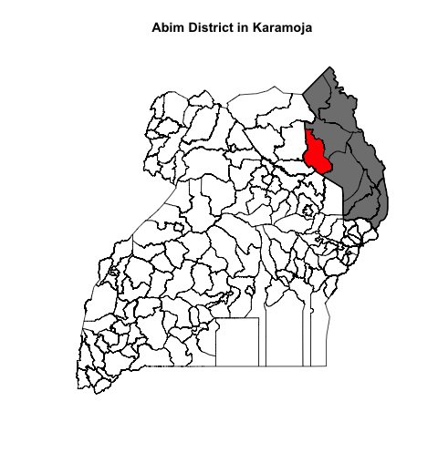

```{r}
library(ramptools)
library(sf)
source("../R/plot_outlines.R")
```


```{r}
png("../images/abim_icon.png", width=480, height=520)
shade_district("Abim District")
dev.off(dev.cur())
```




 

```{r, eval=F}
district_dir <- read.csv("../data/district_directories.csv", header=TRUE)
city_dir <- read.csv("../data/city_directories.csv", header=TRUE)
district_dir <- rbind(district_dir, city_dir)
for(i in 1:146){
   district <- district_dir[i,1]
   print(district)
   dir <- district_dir[i,2]
   icon_name = paste("~/Nextcloud/uganda_intelligence/", dir, "/", dir, "_icon.png", sep="")
   png(icon_name, width=480, height=520)
   shade_district(district)
   dev.off(dev.cur())
}
```

